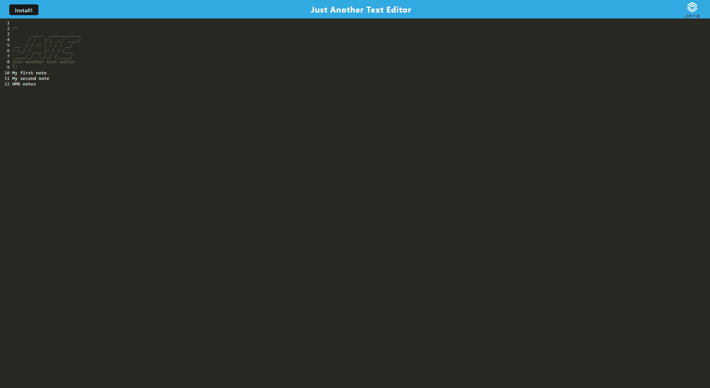

# PWA Text Editor

## Description
Just Another Text Editor (JATE) is a PWA exercise. 
* Notes entered in the editor are automatically stored in an IndexedDB database
* HTML, service worker and manifest files are automatically generated
* Locally installable
* Offline functinonality

## Installation
Run `npm install` to install the required packages.

## Usage
Run `npm run start` to launch the editor.

## GitHub Repo
https://github.com/whitneywishart/pwa-text-editor

## Heroku Deployment
https://

### Screenshot

